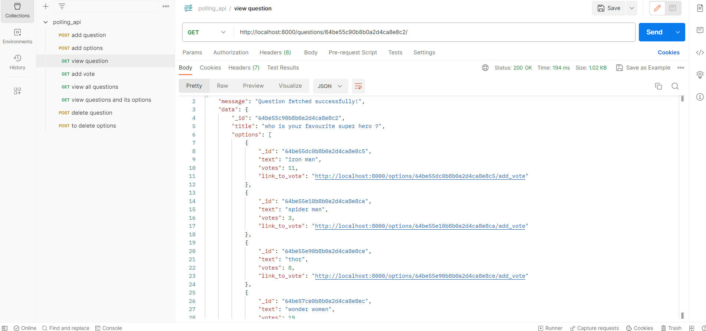

# POLLING SYSTEM API

A simple polling system api where anyone can create questions with options and can also add votes to those options.
- Sample Question
  

## Requirements

- Install [Node.js](https://nodejs.org/en/)
- Install [MongoDB](https://docs.mongodb.com/manual/installation/)
- Install [Postman](https://www.postman.com/downloads/) or use any other api testing tool

## Getting Started

- Clone the repository

```
git clone <repo url> <project_name>
```

- Install dependencies

```
npm install
```

- Open "config/mongoose.js" and add MongoDB URI, local or Atlas

- Build and run the project

```
npm start
```

- Navigate to `http://localhost:8000/` in the postman or any other API testing app

##### As the project is developed solely as an API without a frontend for user visualization, it cannot be hosted with a URL.

## Endpoints for testing the API

- /questions/create (To create a question)
- /questions/:questionId/options/create (To add options to a specific question)
- /questions/:questionId/delete (To delete a question)
- /options/:optionId/delete (To delete an option)
- /options/:optionsId/add_vote (To increment the count of votes)
- /questions/:questionId (To view a question and it’s options)
- /questions/ (To list down all the questions)

---
